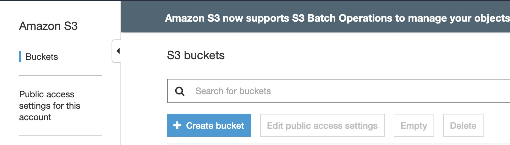

# Set S3 CORS Configuration to complete cross-domain request

## Overview

Cross-Origin Resource Sharing (CORS)is a mechanism that uses additional HTTP headers to allow user agents currently browsing a website to gain access to specific resources on other source (domain) servers. When a user agent requests a resource that is not the current source of the document — for example, from a different domain, protocol, or port —Create a cross-origin HTTP request.

Take an example of cross-origin request: http://domain-a.com HTML page inside a `` tag's src attribute loaded from http://domain-b.com/image.jpg image. Many pages on the web today include resources such as CSS stylesheets, image images, and scripts from domains that are separate from their location, such as content delivery networks (content delivery networks, CDN).
For security reasons, cross-origin HTTP requests made by code are restricted. For example, XMLHttpRequest and Fetch all follow the [same-origin policy](https://en.wikipedia.org/wiki/Same-origin_policy). This means that the API used by the web application can only request HTTP resources in the same domain as the application unless using CORS headers.

## Scenario

<p align="center">
    
</p>

- In this tutorial, we will create **S3 Bucket** x2, host each of their static web pages, and host them in **A Bucket** via Javascript to simulate cross-domain requests by loading the web content of **B Bucket**. We will first try **CORS Configuration** that has not been set up, we will see an error message, and then add **CORS Configuration** Set up to see the results.

## Prerequisites

- AWS account
- Open terminal and type the following code to download the files in this tutorial.

```
$ git clone https://github.com/ecloudvalley/AWS-S3-CORS.git
```

## Create S3 Bucket and upload file

Now, we create two **S3 Bucket** to simulate the scenario, since **S3 Bucket** creation must be unique named, so in host two static web pages are different domains. Based on the same-origin policy, there are currently three behaviors between non-homogeneous sources are restricted .

- Cookie、LocalStorage and IndexDB Unable to read
- DOM Unable to get.
- AJAX The request cannot be sent.

Although these limitations are necessary, there are times when they are inconvenient and reasonable use is compromised. One of the ways to circumvent these three limitations is described below.：**CORS**

1.  login to AWS console [AWS console](https://console.aws.amazon.com/console/home?region=us-east-1)
2.  At the top of the console, click **Services** -> **S3**

3.  click **Create bucket**

<p align="center">
    
</p>

4.  type **Bucket name** : `<YOUR-BUCKET-NAME>`. In this tutorial we call it `Bucket-1`
    > Bucket name must be unique
5.  choose **Region**, in here we choose **US East(N. Virginia)** -> **Create**

6.  after creation, click **Bucket-1** we just creat, click **Properties**
7.  choose **Static website hosting**, check **Use this bucket to host a website**

<p align="center">
    
</p>

8.  **index document** type：`index.html`, **error document** type：`error.html`
9.  Back to **`Bucket-1`**
10. click **Upload** -> **Add files** -> Select files downloaded from this tutorial(**load.html**)

    <p align="center">
        
    </p>

11. **Next** -> **Manage public permissions** choose **Grant public read access to this object(s)** -> **Next** -> **Next** -> **Upload**
12. now we back to **Bucket-1** -> **Prorperties** -> **Static website hosting**. Because we are not storing **index.html** file in this **Bucket**, to load **load.html** need to add **/load.html** behind the URL.

    <p align="center">
        
    </p>

13. You can see that the web page is displayed normally

14. Now we create another **Bucket**, remember that **Bucket name** must be
    unique, in this demo **Bucket Name** ：`<YOUR-BUCKET-NAME>`, we call it **`Bucket-2`**

15. do the same thing as the **`Bucket-1`**

16. just only have to upload **index.html error.html** to **`Bucket-2`**
    > remember to choose "Grant public read access to this object(s)"
    > if you forget, just back to the bucket, and select the file ->
    > Ations -> Make public

## Before Set S3 CORS

Now we check wheather the website was successfully loaded all of the content before we set S3 CORS.

<p align="center">
    
</p>

17. At this point, we can see that the contents of `load.html` were not loaded successfully.
18. **`Bucket-2`** Host web page cannot be totally loaded because of the same origin policy. Then we set **CORS** to the second Bucket that accepts cross-domain requests.

19. At the top of the browser, tap **view** -> **Developer** -> **JavaScript Console**


    <p align="center">
        
    </p>

20. or right click in the web page -> **Inspect**

    <p align="center">
        
    </p>

21. will see the error message as shown in the image. The error message is because in **index.html**, we use **javascript** to load **load.html**, based on the same-origin policy mentioned earlier, before we have set **CORS**, cross-domain requests will be blocked, so the content of **load.html** cannot be loaded.
    <p align="center">
        
    </p>

## Set S3 CORS

As already demonstrated earlier, CORS is blocked because of cross-domain requests, but there are times when we need to use cross-domain requests. For example, the web application itself is deployed in differentDevelopment separation on server, front and rear end, etc.

22. enter Bucket **jonny-test-cors-media** -> **Permissions** -> **CORS configuration**
23. copy the following code to **CORS configuration** -> **Save**

```
<?xml version="1.0" encoding="UTF-8"?>
<CORSConfiguration xmlns="http://s3.amazonaws.com/doc/2006-03-01/">
<CORSRule>
    <AllowedOrigin>*</AllowedOrigin>
    <AllowedMethod>GET</AllowedMethod>
    <MaxAgeSeconds>3000</MaxAgeSeconds>
    <AllowedHeader>Authorization</AllowedHeader>
</CORSRule>
</CORSConfiguration>
```

24. Refresh the page that just appeared with the error message. If the same error message still appears, clear the cache before refreshing

25. Successfully displayed the content of **load.html** in **jonny-test-cors-media**.

<p align="center">
    
</p>

## Cleanup

Just delete the two Bucket directly.

## Conclusion

Now that you have learned how to set up CORS for S3 Bucket, you can configure CORS so that applications from different domains can access the resources within S3.
